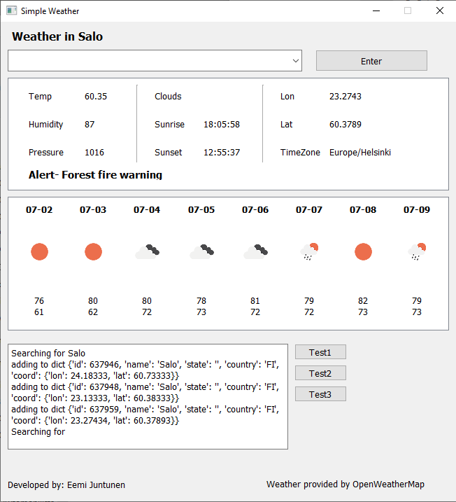

# simpleweather
Program

## About
This is the source code for simple weather.
simple weather uses [PyQt5](https://pypi.org/project/PyQt5/) for the UI

### Installation

### Execution

## Credits
- by [Eemi Juntunen](https://www.eemijun.com/)
- PyQt5 by [Riverbank Computing Limited](https://www.riverbankcomputing.com/software/pyqt/)
